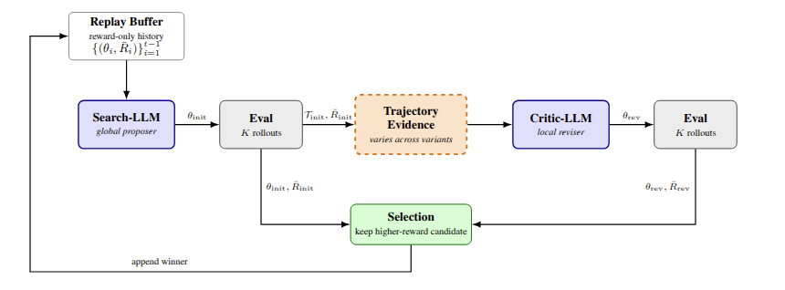

# R2PO

<p align="center">
  
</p>

Code for running Reflective Prompted Policy Optimization (R2PO), baseline policy-search experiments, SB3 baselines, and analysis scripts.

## Paper

Reflective Prompted Policy Optimization: Trajectory-Grounded Revision and Salience Bias. Paper link coming soon.

## Contributions

- A two-stage LLM policy optimizer that separates global parameter search from local rollout-grounded revision.
- A trajectory-evidence design that summarizes policy behavior with aggregate rollout statistics, a median trajectory, and a conservative revision rule.
- An analysis of salience bias, a failure mode where trajectory-grounded revision overreacts to vivid but unrepresentative failures.
- Matched-budget ablations that isolate the roles of trajectory evidence, two-stage reasoning, and keep-best selection.

## Key Results

- Using `gpt-oss:20b-cloud`, R2PO achieves the highest mean reward on 9 of 10 environments; on MountainCarContinuous it is statistically tied with SAC.
- R2PO matches or exceeds all baselines on mean best reward across all 10 environments, reaching maximum return on CartPole, InvertedPendulum, Pong, and Nim.
- Compared with ProPS+, R2PO performs better on all 10 environments and reaches strong policies earlier, including near-optimal CartPole performance within about 500 episodes.
- Ablations show that the gains do not come from extra LLM calls or richer prompts alone; they require trajectory-grounded revision, two-stage design, and keep-best selection.
- The salience-bias analysis explains 76.6% of ThreeTraj regressions on CartPole; R2PO mitigates this with aggregate statistics, median-trajectory selection, and the revision rule.


## Installation

We recommend Python 3.12 with `uv`. Python 3.10+ should also work, but the released experiments were checked with Python 3.12.

```bash
uv venv --python 3.12
uv pip install -r requirements.txt
uv pip install -e envs/gym-maze-master
uv pip install "gymnasium[mujoco]"
uv pip install "stable-baselines3[extra]" sb3-contrib
```

If you prefer Conda for Python management, create the environment with Conda and still use `uv` for package installation:

```bash
conda create -n r2po python=3.12
conda activate r2po
uv pip install -r requirements.txt
uv pip install -e envs/gym-maze-master
uv pip install "gymnasium[mujoco]" "stable-baselines3[extra]" sb3-contrib
```

## API Key Setup

Copy the example environment file and fill in the provider you will use:

```bash
cp .env.example .env
```

The configs use Ollama-format model names, for example:

```yaml
llm_model_name: ollama/gpt-oss:20b-cloud
```

For local Ollama, run the Ollama server locally and set:

```dotenv
OLLAMA_BASE_URL=http://localhost:11434
# OLLAMA_API_KEY is not needed for local Ollama
```

For Ollama cloud / `gpt-oss:20b-cloud`, set:

```dotenv
OLLAMA_BASE_URL=https://ollama.com
OLLAMA_API_KEY=your_ollama_api_key_here
```

The code sends Ollama requests to `$OLLAMA_BASE_URL/api/chat` and uses the model name after the `ollama/` prefix. For example, `ollama/gpt-oss:20b-cloud` becomes `gpt-oss:20b-cloud` in the request payload.

Optional provider keys are also supported for configs that use those model names:

```dotenv
OPENAI_API_KEY=your_openai_key_here
ANTHROPIC_API_KEY=your_anthropic_key_here
GEMINI_API_KEY=your_gemini_key_here
```

## Running One Experiment From Scratch

Run a single R2PO experiment on CartPole:

```bash
uv run python main.py --config configs/cartpole/cartpole_reflective_prompted_policy_optimization.yaml
```

Run a single baseline or ablation by changing the config path, for example:

```bash
uv run python main.py --config configs/cartpole/cartpole_props.yaml
uv run python main.py --config configs/cartpole/cartpole_propsp.yaml
uv run python main.py --config configs/cartpole/cartpole_reptraj.yaml
uv run python main.py --config configs/cartpole/cartpole_three_traj.yaml
```

Each run writes to the `logdir` specified in the config and creates an auto-incremented `run_N/` directory.

Evaluate an existing experiment log without rerunning training:

```bash
uv run python eval.py \
  --logdir logs/cartpole_reflective_prompted_policy_optimization \
  --labels R2PO
```

## Running SB3 Baselines

This repo does not vendor `rl-baselines3-zoo`. If you want to run Zoo-based baselines, install it beside the repo after setting up the main environment:

```bash
git clone https://github.com/DLR-RM/rl-baselines3-zoo.git
cd rl-baselines3-zoo
uv pip install -e .
cd ..
```

SB3 baselines use separate configs:

```bash
uv run python sb3_baselines.py --config configs/sb3_baselines/cartpole_sb3.yaml
```

The SB3 runner writes summaries under `logs/<env>_sb3/<algorithm>/summary.json`.

## Analyzing Logs

Training logs are written under `logs/`. To regenerate evaluation summaries from existing logs, run:

```bash
uv run python eval_all_results.py --max-runs 10
```

Paper tables and figures can be regenerated from existing logs with:

```bash
uv run python paper_results_tables.py --preset core --formats md csv png --output-dir paper_results
uv run python paper_reward_curves.py --preset core --output paper_results/core_reward_curves_all.png
uv run python paper_significance_tests.py --comparison-mode all --metric best_reward
```

## Config Names

Experiment configs are grouped by environment under `configs/`. Common suffixes:

- `*_props.yaml`: ProPS
- `*_propsp.yaml`: ProPS+
- `*_reptraj.yaml`: RepTraj
- `*_pure_search.yaml`: PureSearch
- `*_actor_second_pass.yaml`: ActorSecondPass
- `*_critic_only.yaml`: CriticOnly
- `*_always_critic.yaml`: AlwaysCritic
- `*_three_traj.yaml`: ThreeTraj
- `*_reflective_prompted_policy_optimization.yaml`: R2PO

## Citation

Citation coming soon.
